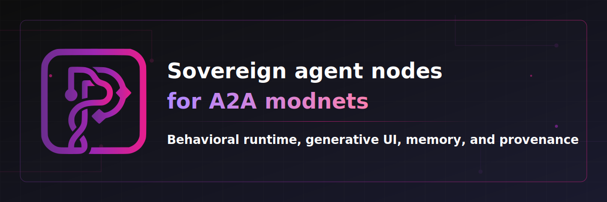

  We believe AI should generate UIs that are correct by construction—not through endless prompt engineering, but through behavioral constraints that encode your design decisions.

  ### Our Stack

  **[plaited](https://github.com/plaited/plaited)** is a neuro-symbolic framework for AI-assisted design. Our agents, skills, and tooling train a world model that generates interfaces
  grounded in your design system.

  **[development-skills](https://github.com/plaited/development-skills)** equips AI coding agents with TypeScript LSP integration (type info, symbol search, reference finding), TSDoc
  documentation standards, cross-agent rule scaffolding, and validation tooling to verify project skills against the AgentSkills specification.

  **[agent-eval-harness](https://github.com/plaited/agent-eval-harness)** is a CLI tool for evaluating AI agents by capturing execution trajectories. Run pass@k evaluations with customizable
  grading functions, schema-driven adapters, and Unix-style composable pipelines.

  **[skills-installer](https://github.com/plaited/skills-installer)** distributes Plaited skills to projects using agents that support the AgentSkills specification.

  ### Get Started

  ```bash
  bun add plaited

  https://github.com/plaited/plaited · https://agentskills.io/
  ```
