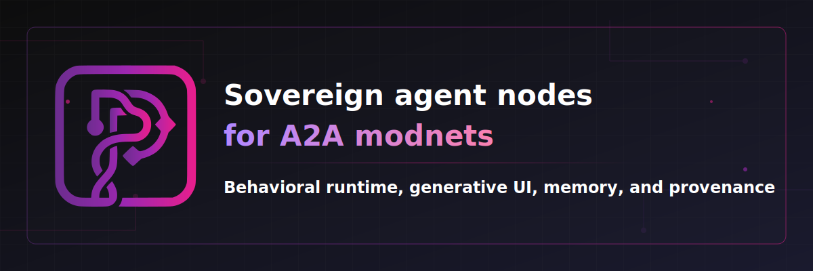

Plaited builds **sovereign agent nodes**.

Each node is owned by one user or organization, keeps its modules and memory local, records its own provenance, and collaborates with other nodes through A2A instead of a central platform.

### Layer 1: What Plaited Is Building

- **Sovereign nodes** with local modules, constitutions, memory, and provenance
- **Modnets** where nodes exchange tasks, services, artifacts, and controlled data
- **Native-model direction** toward end-to-end module and UI generation inside Plaited's own runtime ontology

### Layer 2: How Plaited Works

Plaited provides:

- a behavioral-programming-first runtime
- an agent loop with governance and evaluation seams
- generative UI primitives and controller protocols
- A2A and modnet building blocks
- git plus `.memory/` provenance for node-local work
- dev autoresearch infrastructure for improving the framework itself

**Repository:** [plaited/plaited](https://github.com/plaited/plaited)
