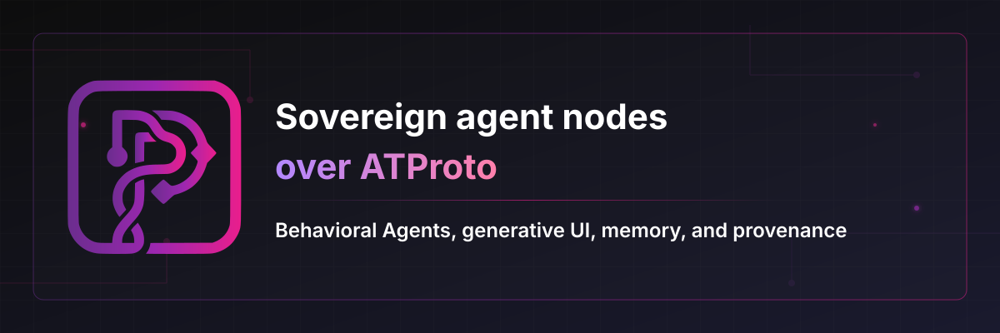

Plaited builds **sovereign agent nodes**.

Each node is owned by one user or organization, keeps its modules and memory local, records its own provenance, and distributes over ATProto instead of through a central platform.

### Layer 1: What Plaited Is Building

- **Sovereign nodes** with local modules, constitutions, memory, and provenance
- **Generative UI** rendered from a behavioral-programming runtime
- **Self-evolving agents** that improve through recorded, verifiable work
- **ATProto distribution and discovery** so nodes publish and find each other without a platform

### Layer 2: How Plaited Works

Plaited provides:

- a behavioral-programming-first runtime
- an agent loop with governance and evaluation seams
- generative UI primitives and controller protocols
- ATProto distribution and discovery building blocks
- git plus `.memory/` provenance for node-local work
- dev autoresearch infrastructure for improving the framework itself

**Repository:** [plaited/plaited](https://github.com/plaited/plaited)
